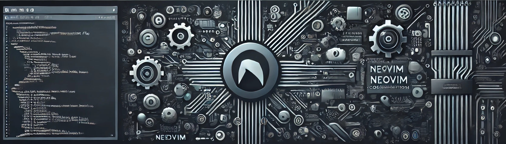

# ⚙️ Neovim Configuration
> "A well-crafted toolset is like a finely tuned instrument – powerful, responsive, and a joy to use."

<div align="center">
 
</div>

This **Neovim configuration** isn't just code; it's a curated experience. Designed with modularity and precision, it encompasses everything from color schemes to advanced plugins, making it a versatile hub for seamless development.

### 🌟 Features & Highlights

- **🌈 Colorscheme & Themes** – Tailored color schemes to keep your workspace inspiring and easy on the eyes.
- **🌟 Custom Dashboard** – Beautiful startup screen with dynamic ASCII art headers and matrix animation.
- **🔑 Custom Keymaps** – Speed up your workflow with intuitive, customized keybindings. See [keybindings reference](./keybindings_reference.md) for details.
- **📂 File Navigation** – Effortlessly explore and manage files with tree views and Neo-tree.
- **📊 Productivity Plugins** – Boost efficiency with tools like `WakaTime`, `Lualine`, and `Dashboard`.

### 📁 Directory Structure

<details>
<summary>Click to expand</summary>

```
.
├── 📁 lua/                    Main configuration directory
│   ├── 📁 configs/           Core configuration
│   │   ├── 🔧 autocommands   Auto commands and events
│   │   ├── 🎨 colorscheme    Theme and colors
│   │   ├── 🛠️  common        Shared utilities
│   │   ├── ⌨️  keymaps       Global key bindings
│   │   └── ⚙️  options       Neovim settings
│   │
│   └── 📁 plugins/           Plugin configurations
│       ├── 📝 editor/        Text editing enhancements
│       │   ├── mini          Essential tools (surround, ai)
│       │   ├── autopairs     Smart bracket pairing
│       │   └── ...
│       │
│       ├── 🛠️ tools/         Productivity tools
│       │   ├── 🤖 ai/        AI assistants
│       │   │   ├── avante    AI code assistance
│       │   │   └── copilot   GitHub Copilot
│       │   ├── finders       Fuzzy finding
│       │   ├── which-key     Keybinding helper
│       │   └── ...
│       │
│       └── 🎯 ui/            User interface
│           ├── lualine       Status line
│           ├── neo-tree      File explorer
│           ├── notify        Notifications
│           └── snacks        Dashboard
│
├── 📜 init.lua               Entry point
├── 🛠️ scripts/              Utility scripts
└── 🖼️ static/               Assets and images
```

</details>

### 🔌 Core Plugins

| Category | Plugin | Purpose |
|----------|--------|---------|
| **UI** |
| | **Neo-tree** | Modern file tree explorer |
| | **Lualine** | Minimalist status line |
| | **Notify** | Notification system |
| | **Snacks** | Beautiful dashboard |
| **Editor** |
| | **Mini.nvim** | Collection of essential tools (surround, ai) |
| | **Treesitter** | Advanced syntax highlighting |
| | **Autopairs** | Automatic bracket pairing |
| **Tools** |
| | **Which-key** | Keybinding helper |
| | **Telescope** | Fuzzy finder |
| | **Harpoon** | File marking and navigation |
| | **OSCYank** | System clipboard integration |
| **AI** |
| | **Copilot** | GitHub Copilot integration |
| | **Avante** | AI code assistance |
| **Git** |
| | **Gitsigns** | Git integration in editor |
| | **Diffview** | Git diff viewer |

---

### 🔌 Core Plugins

| Plugin             | Purpose                                  |
|--------------------|------------------------------------------|
| **WakaTime**       | Track coding stats and boost productivity|
| **Neo-tree**       | Modern file tree explorer               |
| **Lualine**        | Minimalist status line                   |
| **Treesitter**     | Syntax highlighting and more            |
| **ToggleTerm**     | In-editor terminal management           |
| **Diffview**       | Git diff view for seamless version control |
| **Obsidian**       | Markdown and note management            |
| **Snacks**         | Beautiful dashboard with dynamic headers |

With this setup, I strive to create a **workspace as dynamic and adaptable as the coder** – because every line deserves a development environment that keeps up.

## Dependencies

> ⚠️ **Important Note for Ubuntu Users**: The default Neovim package in Ubuntu's standard repositories is often outdated. This configuration requires Neovim >= 0.9.0 for full functionality, as many plugins use newer APIs. You **must** install Neovim from the unstable PPA to get the latest version.

Required dependencies:
- neovim >= 0.9.0 (required for plugin compatibility)
- git
- ripgrep (for telescope)
- fd-find (for telescope)
- cmatrix
- nodejs >= 16 (for copilot)
- python3
- markdownlint-cli (for markdown linting)

Install dependencies on Ubuntu/Debian:
```bash
# Add neovim unstable PPA (REQUIRED for Ubuntu)
sudo add-apt-repository ppa:neovim-ppa/unstable
sudo apt update

# Verify neovim version after installation
nvim --version  # Should be >= 0.9.0

# Install system dependencies
sudo apt install neovim git ripgrep fd-find cmatrix python3 python3-pip nodejs npm

# Install markdownlint-cli using npm
npm install -g markdownlint-cli
```

For other Linux distributions, ensure you install Neovim >= 0.9.0 from appropriate sources:
- Arch Linux: `pacman -S neovim` (latest version in official repos)
- Fedora: `dnf install neovim` (usually up to date)
- Manual installation: [Neovim GitHub Releases](https://github.com/neovim/neovim/releases)

## Roadmap
Make Neovim COOL

## Contributing
Contributions are always welcome!
See `contributing.md` for ways to get started.
Please adhere to this project's `code of conduct`.

## 🚀 About Me
I am a passionate and dedicated design engineer specializing in Linux kernel development, embedded systems, and driver development.

## 🔗 Links
[](https://simayonthampi.me)

## Acknowledgements
- [Kickstart.nvim](https://github.com/nvim-lua/kickstart.nvim) - The one thing I recommend for beginners to become a pro in neovim

## License
[MIT](https://choosealicense.com/licenses/mit/)
